```mermaid {scale: .9, theme: 'dark'}
flowchart TD
    A["🤖 Artificiële Intelligentie (AI)"] --> B["📊 Machine Learning"]
    B --> C["🧠 Deep Learning"]
    C --> D["✨ Foundation Models & Generatieve AI"]
    
    A1["Machines die intelligent gedrag vertonen"] --- A
    B1["Leren van data zonder expliciete programmering"] --- B
    C1["Neurale netwerken met meerdere lagen"] --- C
    D1["ChatGPT, DALL-E, enz."] --- D
    
    style A fill:#C6B6FF,stroke:#9F89D7,color:black
    style B fill:#9F89D7,stroke:#7B5DC7,color:black
    style C fill:#7B5DC7,stroke:#5A32C8,color:white
    style D fill:#5A32C8,stroke:#4A2BA8,color:white
    
    style A1 fill:none,stroke:none,color:white
    style B1 fill:none,stroke:none,color:white
    style C1 fill:none,stroke:none,color:white
    style D1 fill:none,stroke:none,color:white
```

---
# Layout
theme: seriph
colorSchema: "dark"
background: "#19EB96"
favicon: "./theme-expertum/favicon-32x32-Expertum.png"
fonts:
  # Text
  sans: "Sora Light"
  # Code
  mono: "Victor Mono"
highlighter: shiki
lineNumbers: false

# Metadata
title: Artificiële Intelligentie
author: Darko Boesmans & Lazhar Rezkallah
info: |
  ## Artificiële Intelligentie
  Artificiële Intelligentie binnen SAP

# Extra
class: text-center
drawings:
  persist: false
transition: slide-left
mdc: true
layout: cover
hideInToc: true
---

<style>
img {
  display: block;
  width: 50%;
  margin-left: auto;
  margin-right: auto;
}

.presentation-title {
  color: #ffffff;
  font-weight: bold;
}
</style>

# <CENTER></CENTER>

<div class="mt-5">
  Artificiële Intelligentie binnen SAP
</div>

---
hideInToc: true
transition: slide-left
---

# Table of contents

<Toc maxDepth="1"></Toc>


---
layout: two-cols-header
transition: slide-left
---

# Wat is AI?

- "Intelligence: het vermogen om complexe doelen te bereiken" (Max Tegmark, Life 3.0)
- "Artificiële Intelligentie: intelligentie vertoond door niet-biologische systemen"

::left::

## Weak AI (Narrow AI)
- Vermogen om een beperkte set doelen te bereiken  
- *Voorbeeld: IBM's Deep Blue (1997)*

::right::

## Strong AI (AGI)
- Vermogen om elke intellectuele taak te begrijpen die een mens kan  
- *"Sparks of AGI: Early experiments with GPT-4"*

---
layout: image-right
image: https://www.elcorreo.com/xlsemanal/wp-content/uploads/sites/5/2023/04/alan-turing-inventor-informatica-espia-codigo-enigma-segunda-guerra-mundial.jpg
transition: slide-left
---

# Alan Turing (1912-1954)

- 🧠 Universele Turing Machine (UTM)
- 🔐 Ontcijferde de Enigma-code (WOII)
- ⚠️ Bewees het halting problem
- 🤖 Uitvinder van de Turing Test

---
layout: image
image: https://images.nemokennislink.nl/uploads/02_alan_turing_large.jpg
backgroundSize: cover
transition: slide-left
---

<div class="absolute inset-0 bg-black/70 flex items-center justify-center">
  <div class="text-center max-w-2xl p-8">
    <p class="text-3xl italic leading-relaxed text-white">
      "I believe that at the end of the century the use of words and general educated opinion will have altered so much that one will be able to speak of machines thinking without expecting to be contradicted."
    </p>
    <p class="mt-4 text-xl text-white/90">— Alan Turing</p>
  </div>
</div>


---
layout: center
class: text-center
---



---
layout: default
transition: slide-left
---

# Limitations van Generatieve AI

<div class="grid grid-cols-2 gap-6">
<div>

## Hallucinations
- AI genereert plausibele maar onjuiste informatie
- Voorbeeld: ChatGPT maakt foutieve samenvatting van een boek

```text
Prompt: Maak een korte samenvatting van het boek 
'Het verdriet van België' door Louis-Paul Boon.

ChatGPT 3.5: "Het verdriet van België" ("The Sorrow 
of Belgium") door Louis-Paul Boon is een 
semi-autobiografische roman...
```

- **Belangrijk**: Foundation Models weten niets, ze berekenen alleen waarschijnlijkheden

</div>
<div>

## Kennisbeperkingen
- Kennis bevroren op trainingsmoment
- Geen besef van actualiteit na trainingsdatum

```text
Prompt: Ik wil The Crooked House bezoeken, een 
historische 18e-eeuwse pub in Staffordshire. 
Wat moet ik weten?

ChatGPT 3.5: Een bezoek aan The Crooked House 
klinkt fantastisch! Hier is wat je moet weten: ...
```

- The Crooked House brandde af in 2023, maar ChatGPT 3.5 werd getraind tot januari 2022

</div>
</div>

---
layout: default
transition: slide-left
---

# Meer Beperkingen van AI

<div class="grid grid-cols-2 gap-6">
<div>

## Inconsistente Wiskundige Vaardigheden
- Moeite met eenvoudige berekeningen
- Verwarrende tijdsperceptie

```text
Prompt: Geef een woord met precies 3 b's, 2 a's en een e.

ChatGPT 3.5: Het woord "beanbag" voldoet aan je criteria: 
het heeft 3 b's, 2 a's en een e.
```

```text
Prompt: Wat gebeurde eerder: het zinken van The Herald 
of Free Enterprise of het 'Heizeldrama'?

ChatGPT 3.5: Het zinken van de Herald of Free Enterprise 
vond plaats op 6 maart 1987, terwijl het Heizeldrama 
plaatsvond op 29 mei 1985.
```

</div>
<div>

## Sterk in Standaardproblemen
- Goed in het oplossen van bekende vraagstukken
- Volgt aangeleerde methodieken

```text
Prompt: Twee auto's rijden noordwaarts. De eerste rijdt 
40 km/u, de tweede vertrekt 3 uur later en rijdt 60 km/u. 
Hoe lang na het vertrek van de tweede auto haalt deze 
de eerste in?

Bing Copilot: 
Laat T de tijd voorstellen die de eerste auto rijdt.
De tweede auto start 3 uur later, dus zijn tijd is (T - 3).
Afstand eerste auto: 40T kilometer.
Afstand tweede auto: 60(T - 3) kilometer.
40T = 60(T - 3)
40T = 60T - 180
-20T = -180
T = 9
Antwoord: 6 uur na vertrek tweede auto.
```

</div>
</div>

---
layout: image-right
image: https://images.unsplash.com/photo-1633409361618-c73427e4e206?q=80&w=1000&auto=format&fit=crop
transition: slide-left
---

# Prompt Engineering

- De kunst van het formuleren van effectieve prompts
- Essentiële vaardigheid voor optimaal AI-gebruik
- Structuur, context en specificiteit zijn cruciaal

## Belangrijke Technieken
- **Chain-of-Thought**: leid het model door complexe redeneringen
- **Few-Shot Learning**: geef voorbeelden in de prompt
- **System Prompts**: stel de rol en gedrag van de AI in
- **Temperature-instelling**: controle over creativiteit vs precisie

---
layout: image-left
image: https://images.unsplash.com/photo-1558494949-ef010cbdcc31?q=80&w=1000&auto=format&fit=crop
transition: slide-left
---

# Retrieval Augmented Generation (RAG)

- Combineert LLMs met externe kennisbronnen
- Vermindert hallucinaties
- Houdt informatie up-to-date

## Werking
1. **Embeddings**: vectorrepresentaties van tekst
2. **Retrieval**: zoek relevante informatie in kennisbank
3. **Generation**: antwoord genereren met gevonden context
4. **Orchestration**: het hele proces beheren

## Voordelen voor SAP
- Integratie met bedrijfsspecifieke data
- Nauwkeurigere en betrouwbaardere antwoorden
- Verminderd risico op foutieve informatie

---
layout: section
transition: slide-up
---

# AI binnen SAP

<div class="flex justify-center">
  <div class="text-center max-w-2xl">
    <p class="text-xl mt-4 opacity-80">
      Van intelligent ERP naar intelligente onderneming
    </p>
  </div>
</div>

<style>
h1 {
  background-image: linear-gradient(45deg, #5A32C8, #C6B6FF);
  background-clip: text;
  -webkit-background-clip: text;
  color: transparent;
  font-size: 3rem !important;
}
</style>

---
layout: default
transition: slide-left
---

# AI Toepassingen binnen SAP

<div class="grid grid-cols-2 gap-6">
<div>

## SAP AI Core

- **Platform** voor ontwikkeling en beheer van AI-modellen
- **Schaalbaarheid** met containerization (Kubernetes)
- **Integratie** met bestaande SAP-oplossingen
- **Governance** met versioning en monitoring

</div>
<div>

## SAP AI Launchpad

- **Centrale hub** voor AI-projecten en modellen
- **Monitoring** van model performance
- **Gebruiksvriendelijke interface** voor modelmanagement
- **Samenwerking** tussen teams faciliteren

</div>
</div>

---
layout: default
transition: slide-left
---

# Generatieve AI in SAP

<div class="grid grid-cols-2 gap-6">
<div>

## Joule (Business AI Assistant)

- **Natural language interface** voor SAP-systemen
- **Context-aware** ondersteuning binnen SAP-applicaties
- **Automatisering** van routinetaken
- **Data-analyse** met natuurlijke taal

</div>
<div>

## SAP Build Code

- **Low-code/No-code** ontwikkeling met AI-ondersteuning
- **Code generatie** voor ABAP, CAP en JavaScript
- **AI-assistentie** bij ontwikkeling
- **Versnelling** van implementatieprocessen

</div>
</div>

---
layout: default
transition: slide-left
---

# Business-specifieke AI-toepassingen

<div class="grid grid-cols-2 gap-6">
<div>

## SAP S/4HANA

- **Predictive analytics** in financiële processen
- **Intelligente automatisering** van workflows
- **Anomaliedetectie** in transacties
- **Smart matching** van facturen en betalingen

</div>
<div>

## SAP Customer Experience

- **Gepersonaliseerde klantervaringen**
- **Voorspellende verkoopanalyses**
- **Sentiment-analyse** van klantfeedback
- **Intelligente product-aanbevelingen**

</div>
</div>

---
layout: default
transition: slide-left
---

# Orchestration Tools: "Agents"

<div class="grid grid-cols-2 gap-6">
<div>

## Wat zijn AI Agents?
- Autonome AI-systemen die taken uitvoeren
- Kunnen beslissingen nemen en acties ondernemen
- Aaneenschakeling van verschillende AI-modellen
- Interactie met externe systemen en APIs

## Agent Frameworks
- **LangChain**: flexibel framework voor AI-workflows
- **AutoGPT**: zelfstandige, doelgerichte agents
- **BabyAGI**: taakbeheer en prioritering

</div>
<div>

## Toepassingen in SAP
- **Procesautomatisering**: complexe workflows automatiseren
- **Beslissingsondersteuning**: data-analyse en aanbevelingen
- **Anomaliedetectie**: proactieve controle en melding
- **Klantenservice**: geautomatiseerde probleemoplossing

## Uitdagingen
- Betrouwbaarheid en consistentie
- Security en toegangscontrole
- Menselijke supervisie
- Ethische overwegingen

</div>
</div>

---
layout: image-right
image: https://www.sap.com/content/dam/marketing/commerce/images/joule/joule-purple-chip-1216x684.jpg/_jcr_content/renditions/original.transform/dam-image-tablet/joule-purple-chip-1216x684.jpg
transition: slide-left
---

# SAP Copilot Joule

SAP's AI-assistent die natuurlijke taal gebruikt om SAP-systemen toegankelijker te maken.

## Kernfunctionaliteiten
- **Conversatie-interface** voor SAP-toepassingen
- **Contextbewuste** ondersteuning en analyses
- **Multi-modale interactie**: tekst, spraak, afbeeldingen
- **Workflow-automatisering** en procesversnelling

## Integratie
- S/4HANA, SAP SuccessFactors, SAP Customer Experience
- SAP Business Technology Platform
- Verbinding met externe AI-diensten via SAP AI Core

---
layout: image-left
image: https://www.sap.com/dam/application/shared/images/images/sapcom-page-banner-70-30.jpg
transition: slide-left
---

# Just Ask & Document Processing

## Natuurlijke Taal Verwerking
- Documenten begrijpen en interpreteren
- Automatische extractie van informatie
- Intelligente classificatie en verwerking

## Voordelen
- **Tijdsbesparing**: automatisering van handmatige processen
- **Nauwkeurigheid**: vermindering van verwerkingsfouten
- **Schaalbaarheid**: verwerking van grote documentvolumes
- **Inzicht**: betere data-extractie voor besluitvorming

## Use Cases
- Factuurverwerking
- Contractanalyse
- Compliance-documentatie
- Klantcorrespondentie

---
layout: default
transition: slide-left
---

# Domains voor Use Cases

<div class="grid grid-cols-3 gap-6">
<div class="bg-gradient-to-br from-[#7B5DC7] to-[#9F89D7] p-6 rounded-lg text-white">
  <h3 class="text-xl mb-2">Finance & Accounting</h3>
  <ul class="space-y-2 opacity-90">
    <li>Automatische factuurverwerking</li>
    <li>Fraude-detectie met ML</li>
    <li>Cash flow-voorspellingen</li>
    <li>Uitgavenanalyse en -optimalisatie</li>
  </ul>
</div>

<div class="bg-gradient-to-br from-[#5A32C8] to-[#7B5DC7] p-6 rounded-lg text-white">
  <h3 class="text-xl mb-2">Supply Chain</h3>
  <ul class="space-y-2 opacity-90">
    <li>Vraagvoorspelling</li>
    <li>Inventarisoptimalisatie</li>
    <li>Logistieke routeplanning</li>
    <li>Leveranciersevaluatie</li>
  </ul>
</div>

<div class="bg-gradient-to-br from-[#9F89D7] to-[#C6B6FF] p-6 rounded-lg text-white">
  <h3 class="text-xl mb-2">Human Resources</h3>
  <ul class="space-y-2 opacity-90">
    <li>Intelligente werving en selectie</li>
    <li>Employee engagement analyse</li>
    <li>Gepersonaliseerde training</li>
    <li>Werkbelastingbeheer</li>
  </ul>
</div>
</div>

<div class="mt-8 grid grid-cols-2 gap-6">
<div class="bg-gradient-to-br from-[#4A2BA8] to-[#5A32C8] p-6 rounded-lg text-white">
  <h3 class="text-xl mb-2">Sales & Marketing</h3>
  <ul class="space-y-2 opacity-90">
    <li>Klantgedraganalyse</li>
    <li>Gepersonaliseerde marketing</li>
    <li>Verkoopkansvoorspelling</li>
    <li>Sentimentanalyse</li>
  </ul>
</div>

<div class="bg-gradient-to-br from-[#C6B6FF] to-[#9F89D7] p-6 rounded-lg text-white">
  <h3 class="text-xl mb-2">IT & Development</h3>
  <ul class="space-y-2 opacity-90">
    <li>Codeanalyse en -suggesties</li>
    <li>Automatische testgeneratie</li>
    <li>Incident response-automatisering</li>
    <li>Infrastructuuroptimalisatie</li>
  </ul>
</div>
</div>

---
layout: image-right
image: https://images.unsplash.com/photo-1485827404703-89b55fcc595e?q=80&w=1000&auto=format&fit=crop
transition: slide-left
---

# Ethische & Sociale Aspecten van AI

## Kernuitdagingen
- **Bias & Fairness**: oneerlijke vooroordelen tegengaan
- **Transparantie**: begrijpelijke AI-besluitvorming
- **Privacy**: bescherming van persoonlijke gegevens
- **Verantwoordelijkheid**: wie is aansprakelijk?

## SAP's Aanpak
- **Ethische richtlijnen** voor AI-ontwikkeling
- **Diverse trainingsdatasets** om bias te verminderen
- **Explainable AI** voor transparantie
- **Data governance** en privacybescherming

## Toekomstperspectief
- Balans tussen innovatie en ethische overwegingen
- Mensgerichte AI-ontwikkeling
- Samenwerking met stakeholders
- Aanpassingsvermogen aan evoluerende normen

---
layout: section
transition: slide-up
---

# AI binnen IVAGO Waste-App

<div class="flex justify-center">
  <div class="text-center max-w-2xl">
    <p class="text-xl mt-4 opacity-80">
      Computer Vision voor afvalherkenning
    </p>
  </div>
</div>

<style>
h1 {
  background-image: linear-gradient(45deg, #5A32C8, #C6B6FF);
  background-clip: text;
  -webkit-background-clip: text;
  color: transparent;
  font-size: 3rem !important;
}
</style>

---
layout: default
transition: slide-left
---

# Computer Vision voor Afvalherkenning

<div class="grid grid-cols-2 gap-6">
<div>

## Project Overzicht
- **Doel**: Automatisch herkennen van afvaltypes en sluikstort
- **Technologie**: SAP AI Core met Computer Vision Package
- **Dataset**: Getraind op afbeeldingen van verschillende afvaltypes
- **Integratie**: Verbonden met IVAGO's rapportage- en opvolgingssysteem

## Workflow
1. Foto maken van afval/sluikstort
2. Automatische analyse door CV model
3. Classificatie van afvaltype
4. Suggestie van gepaste opvolgingsactie
5. Rapportage aan juiste afdeling

</div>
<div>

## Technische Implementatie
- SAP AI Core voor modelhosting
- SAP HANA Cloud als data-opslag
- UI5-applicatie voor gebruikersinterface
- CAP (Cloud Application Programming) voor backend

<div class="bg-gradient-to-br from-[#5A32C8] to-[#9F89D7] p-4 rounded-lg text-white mt-4">
  <h3 class="text-lg mb-2">Voordelen</h3>
  <ul class="space-y-1 opacity-90">
    <li>⏱️ Snellere verwerking van meldingen</li>
    <li>🎯 Accurate classificatie (>90% nauwkeurigheid)</li>
    <li>📊 Betere data voor trendanalyse</li>
    <li>🔄 Automatisering van routinetaken</li>
  </ul>
</div>

</div>
</div>

---
layout: image-right
image: /assets/todo/8R1Q9XR5ASGS90L25VDY6TRB.jpg
class: "text-white"
transition: slide-left
---

# Demo: Afvalherkenning

## Model Training & Performance

- Getraind op **2000+ afbeeldingen** van sluikstort
- Onderscheidt **8 verschillende afvaltypes**:
  - Huishoudelijk afval
  - Bouwafval
  - Groenafval
  - Elektronisch afval
  - Plastic
  - Meubels
  - Gevaarlijk afval
  - Gemengd afval

## Uitdagingen
- Variabele lichtomstandigheden
- Gedeeltelijk zichtbaar afval
- Meerdere afvaltypes in één beeld
- Seizoensgebonden variaties

---
layout: default
transition: slide-left
---

# Technische Architectuur

<div class="grid grid-cols-2 gap-6">
<div>

## Frontend Components
- **UI5 Framework** voor gebruikersinterface
- **Camera API** voor afbeeldingscapture
- **Report Service** voor meldingsbeheer
- **Location Service** voor geo-tagging

```typescript
// Voorbeeld: AttachmentService
export class AttachmentService {
  async uploadImage(file: File): Promise<string> {
    // Stuurt afbeelding naar backend voor analyse
    const formData = new FormData();
    formData.append('file', file);
    
    const response = await fetch('/api/upload', {
      method: 'POST',
      body: formData
    });
    
    return response.json();
  }
  
  // ...bestaande code...
}
```

</div>
<div>

## Backend Components
- **CAP Service** voor API-endpoints
- **AI Core Connector** voor modelintegratie
- **HANA Persistence** voor dataopslag

```javascript
// Voorbeeld: Computer Vision integratie in service.js
const cds = require('@sap/cds');
const aiCore = require('@sap/ai-core-sdk');

module.exports = cds.service.impl(async function() {
  this.on('analyzeImage', async(req) => {
    const { imageId } = req.data;
    
    // Haal de image data op
    const image = await SELECT.one.from('Images')
      .where({ ID: imageId });
    
    // Stuur naar AI Core voor analyse
    const prediction = await aiCore.predict({
      deploymentId: 'waste-recognition-model',
      data: image.content
    });
    
    // Verwerk resultaten
    return transformPrediction(prediction);
  });
});
```

</div>
</div>

---
layout: section
transition: slide-up
---

# Chat AI Tool: Collega Project

<div class="flex justify-center">
  <div class="text-center max-w-2xl">
    <p class="text-xl mt-4 opacity-80">
      Intelligente assistentie voor klantenservice
    </p>
  </div>
</div>

<style>
h1 {
  background-image: linear-gradient(45deg, #5A32C8, #C6B6FF);
  background-clip: text;
  -webkit-background-clip: text;
  color: transparent;
  font-size: 3rem !important;
}
</style>

---
layout: default
transition: slide-left
---

# Klantenservice Chat AI

<div class="grid grid-cols-2 gap-6">
<div>

## Project Overzicht
- **Doel**: Automatiseren & ondersteunen van klantgesprekken
- **Technologie**: SAP Conversational AI + GPT-integratie
- **Toepassing**: Eerste-lijn support en FAQ's
- **Integratie**: Met IVAGO's klantendatabase

## Kernfunctionaliteiten
- **Meertalige ondersteuning** (NL, FR, EN)
- **Contextbewuste antwoorden**
- **Afvalophaling informatie** (schema's, locaties)
- **Doorverwijzing** naar menselijke agenten indien nodig
- **Integratie** met ticketing-systeem

</div>
<div>

## Voordelen & Resultaten
<div class="bg-gradient-to-br from-[#5A32C8] to-[#9F89D7] p-4 rounded-lg text-white mb-4">
  <h3 class="text-lg mb-2">Business Impact</h3>
  <ul class="space-y-1 opacity-90">
    <li>⬇️ 40% reductie in wachttijd</li>
    <li>⬆️ 24/7 beschikbaarheid</li>
    <li>🔍 Consistente antwoorden</li>
    <li>📊 Verbeterde data-inzichten</li>
  </ul>
</div>

## Technische Implementatie
- **Intent Recognition**: voor gebruikersbedoelingen
- **Entity Extraction**: voor datapunten zoals adressen
- **Dialog Management**: voor natuurlijke gesprekken
- **Knowledge Base**: voor accurate antwoorden
- **SAP BTP**: als cloud-infrastructuur

</div>
</div>

---
layout: center
class: "text-center"
---

# Toekomstperspectief en Samenvatting

<div class="grid grid-cols-2 gap-x-12 gap-y-6 mt-10">
  <div class="bg-gradient-to-br from-[#5A32C8]/10 to-[#9F89D7]/10 p-6 rounded-lg backdrop-blur-sm">
    <h3 class="text-xl font-bold text-[#5A32C8] mb-2">Waste App</h3>
    <ul class="text-left space-y-2">
      <li>🔮 Uitbreiding naar meerdere afvaltypes</li>
      <li>🔮 Realtime monitoring via drones/camera's</li>
      <li>🔮 Predictieve analyses voor proactieve inzet</li>
    </ul>
  </div>
  
  <div class="bg-gradient-to-br from-[#5A32C8]/10 to-[#9F89D7]/10 p-6 rounded-lg backdrop-blur-sm">
    <h3 class="text-xl font-bold text-[#5A32C8] mb-2">Chat Tool</h3>
    <ul class="text-left space-y-2">
      <li>🔮 Multimodale interactie (spraak, beeld)</li>
      <li>🔮 Persoonlijkere gebruikerservaringen</li>
      <li>🔮 Integratie met waste app voor end-to-end service</li>
    </ul>
  </div>
  
  <div class="col-span-2 bg-gradient-to-br from-[#5A32C8]/10 to-[#9F89D7]/10 p-6 rounded-lg backdrop-blur-sm">
    <h3 class="text-xl font-bold text-[#5A32C8] mb-2">Conclusie</h3>
    <p class="text-left">AI transformeert afvalbeheer door intelligente herkenning, efficiënte verwerking en verbeterde klantenservice. De combinatie van computer vision en natuurlijke taalverwerking biedt IVAGO krachtige tools om duurzaamheid te bevorderen en operationele efficiëntie te verhogen.</p>
  </div>
</div>

---
layout: center
class: text-center
---

# Vragen?

<div class="flex justify-center">
  <div class="text-center max-w-2xl">
    <p class="text-xl mt-4 opacity-80">
      Bedankt voor jullie aandacht!
    </p>
  </div>
</div>