```mermaid {scale: .9, theme: 'dark'}
flowchart TD
    A["🤖 Artificiële Intelligentie (AI)"] --> B["📊 Machine Learning"]
    B --> C["🧠 Deep Learning"]
    C --> D["✨ Foundation Models & Generatieve AI"]
    
    A1["Machines die intelligent gedrag vertonen"] --- A
    B1["Leren van data zonder expliciete programmering"] --- B
    C1["Neurale netwerken met meerdere lagen"] --- C
    D1["ChatGPT, DALL-E, enz."] --- D
    
    style A fill:#C6B6FF,stroke:#9F89D7,color:black
    style B fill:#9F89D7,stroke:#7B5DC7,color:black
    style C fill:#7B5DC7,stroke:#5A32C8,color:white
    style D fill:#5A32C8,stroke:#4A2BA8,color:white
    
    style A1 fill:none,stroke:none,color:white
    style B1 fill:none,stroke:none,color:white
    style C1 fill:none,stroke:none,color:white
    style D1 fill:none,stroke:none,color:white
```

---
# Layout
theme: seriph
colorSchema: "dark"
background: "#19EB96"
favicon: "./theme-expertum/favicon-32x32-Expertum.png"
fonts:
  # Text
  sans: "Sora Light"
  # Code
  mono: "Victor Mono"
highlighter: shiki
lineNumbers: false

# Metadata
title: Artificiële Intelligentie
author: Darko Boesmans & Lazhar Rezkallah
info: |
  ## Artificiële Intelligentie
  Artificiële Intelligentie binnen SAP

# Extra
class: text-center
drawings:
  persist: false
transition: slide-left
mdc: true
layout: cover
hideInToc: true
---

<style>
img {
  display: block;
  width: 50%;
  margin-left: auto;
  margin-right: auto;
}

.presentation-title {
  color: #ffffff;
  font-weight: bold;
}
</style>

# <CENTER></CENTER>

<div class="mt-5">
  Artificiële Intelligentie binnen SAP
</div>

---
hideInToc: true
transition: slide-left
---

<!-- TODO: Titels nakijken zodat de toc niet overvol staat -->

# Table of contents

<Toc maxDepth="1"></Toc>


---
layout: two-cols-header
transition: slide-left
---

# Wat is AI?

- **Intelligentie:** "The ability to accomplish complex goals" <br>
  *(Max Tegmark, Life 3.0: Being Human in the Age of Artificial Intelligenc)*
- **Artificiële Intelligentie:** "Intelligentie vertoond door niet-biologische systemen"

::left::

## Weak AI (Narrow AI)
- Vermogen om een beperkte set doelen te bereiken  
- *Voorbeeld: IBM's Deep Blue (1997)*

::right::

## Strong AI (AGI)
- Vermogen om elke intellectuele taak te begrijpen die een mens kan  
- *"Sparks of AGI: Early experiments with GPT-4"*

---
layout: image-right
image: https://www.elcorreo.com/xlsemanal/wp-content/uploads/sites/5/2023/04/alan-turing-inventor-informatica-espia-codigo-enigma-segunda-guerra-mundial.jpg
transition: slide-left
hideInToc: true
---

# Alan Turing (1912-1954)

- **Universal Turing Machine (UTM)**
  - Wiskundige concept van een computer
  - Church-Turing these
- **Halting problem**
  - Er bestaat geen universeel algoritme
- **Enigma-code**
  - Bombe Machine
- **Imitation Game**

<!-- 

-->

<!-- 
  UTM
  - elk modern systeem is hier nog steeds op gebaseerd (behalve quantumcomputers)
  - bewees dat elke UTM een andere UTM kan simuleren

  Halting problem
  - Kan niet voor elk programma bepalen of het stopt of oneindig doorloopt

  Enigma-code
  - Enigma was een cruciale doorbraak die WOII mogelijk heeft bekort

  Imitation Game
  - Test of machines menselijke intelligentie kunnen nabootsen

-->

---
layout: image-left
image: https://images.unsplash.com/photo-1620712943543-bcc4688e7485
transition: slide-left
hideInToc: true
---

# Imitation Game

Een ondervrager probeert te bepalen welke deelnemer een computer is en welke een mens, alleen op basis van geschreven antwoorden

## Setup

- Een ondervrager "C" probeert te bepalen welke deelnemer een computer is ("A" of "B")
- Communicatie gebeurt alleen geschreven

*Verschuift focus van "kan een machine denken?" naar "kan een machine menselijk gedrag imiteren?*

---
layout: two-cols-header
transition: slide-left
hideInToc: true
---

# Turing Test vs. Eliza

Waar de Turing Test een filosofisch experiment was om intelligentie te definiëren, was Eliza een praktische implementatie die aantoonde hoe eenvoudige rule-based systemen de illusie van begrip kunnen wekken (het "ELIZA-effect") zonder werkelijk intelligent te zijn.

::left::

## Eliza (1966)
- Een van de eerste chatbots, ontwikkeld door Joseph Weizenbaum
- Symbolic AI: gebruikt expliciete regels en patroonherkenning
- Simuleerde een psychotherapeut via eenvoudige scripts

::right::

## Verloop
- Zoekt naar sleutelwoorden in gebruikersinvoer
- Past vooraf gedefinieerde antwoordpatronen toe
- Stelt vaak vragen terug aan de gebruiker
- Geen echt "begrip", alleen patroonherkenning
- Verrassend effectief door menselijke neiging om intentie toe te schrijven

<!-- 
SPEAKER NOTES:
- De Turing Test stelt het criterium dat een machine intelligent is als deze ononderscheidbaar is van een mens in gesprek
- ELIZA toonde aan dat schijnbaar "intelligente" gesprekken kunnen worden gesimuleerd met relatief eenvoudige regels
- ELIZA kon veel mensen misleiden dat ze met een intelligent wezen spraken, wat het "ELIZA-effect" wordt genoemd
- Modern verschil: hedendaagse LLMs zoals GPT gebruiken statistische patronen i.p.v. expliciete regels (neural vs. symbolic AI)
- ELIZA is een voorbeeld van "Symbolic AI" - expliciete kennisrepresentatie via regels en deterministische programmering
- De schijnbare intelligentie van ELIZA toont de kloof tussen menselijke neiging om intentionaliteit toe te schrijven en werkelijk begrip

- De Turing Test stelt het criterium dat een machine intelligent is als deze ononderscheidbaar is van een mens in gesprek
- ELIZA toonde aan dat schijnbaar "intelligente" gesprekken kunnen worden gesimuleerd met relatief eenvoudige regels
- ELIZA kon veel mensen misleiden dat ze met een intelligent wezen spraken, wat het "ELIZA-effect" wordt genoemd
- Modern verschil: hedendaagse LLMs zoals GPT gebruiken statistische patronen i.p.v. expliciete regels (neural vs. symbolic AI)
-->

---
layout: iframe-right
url: https://anthay.github.io/eliza.html
---

---
layout: image
image: https://images.nemokennislink.nl/uploads/02_alan_turing_large.jpg
backgroundSize: cover
transition: slide-left
hideInToc: true
---

<div class="absolute inset-0 bg-black/70 flex items-center justify-center">
  <div class="text-center max-w-2xl p-8">
    <p class="text-3xl italic leading-relaxed text-white" style="line-height: 1.25;">
      "I believe that at the end of the century the use of words and general educated opinion will have altered so much that one will be able to speak of machines thinking without expecting to be contradicted."
    </p>
    <p class="mt-6 text-xl text-white/90">— Alan Turing</p>
  </div>
</div>

<!-- 
  In dit citaat uit 1950 voorspelt Turing dat tegen het einde van de 20e eeuw:
  
  1. Onze definitie van "denken" zou veranderen
  2. We zouden accepteren dat machines kunnen "denken" zonder dat dit controversieel zou zijn
  3. De grens tussen menselijke en kunstmatige intelligentie zou vervagen
-->


---
layout: center
class: text-center
transition: slide-up
hideInToc: true
---



<!--
  Artificiële Intelligentie (AI):
  - Is het overkoepelende concept van machines die intelligent gedrag vertonen
    - Omvat alle technieken om computers "intelligent" te make
  - Bestaat al sinds de jaren 1950, maar heeft recent grote doorbraken gekend Machine Learning:
    - Is een subset van AI waarbij systemen leren van data zonder expliciete programmering
    - Voorbeelden: beslissingsbomen, random forests, support vector machines

  - Traditionele ML vereist vaak handmatige feature-engineering Deep Learning:
    - Is een subset van ML gebaseerd op neurale netwerken met meerdere lagen
    - Kan automatisch features leren uit ruwe data
    - Vereist grote hoeveelheden data en rekenkracht

  - Heeft geleid tot doorbraken in computer vision, NLP en spraakherkenning Foundation Models & Generatieve AI:
    - Foundation models zijn grote modellen getraind op enorme datasets
    - Generatieve AI kan nieuwe content creëren (tekst, afbeeldingen, code)
    - Voorbeelden zijn GPT-4, Claude, DALL-E, Midjourney, GitHub Copilot

  - Deze modellen hebben revolutionaire mogelijkheden maar ook nieuwe uitdagingen De evolutie van AI toont een steeds toenemende complexiteit en capaciteit, waarbij elke nieuwe laag voortbouwt op de voorgaande en nieuwe mogelijkheden introduceert.
-->

---
layout: section
transition: slide-left
---

# Van Concept naar Realiteit

De evolutie van AI van theoretisch concept naar praktische toepassingen

---
layout: section
transition: slide-left
hideInToc: true
---

## De limitaties

---
layout: default
transition: slide-left
---

# Limitations van Generatieve AI

<div class="grid grid-cols-2 gap-6">
<div>

## Hallucinations
- AI genereert plausibele maar onjuiste informatie
- Voorbeeld: ChatGPT maakt foutieve samenvatting van een boek

```text
Prompt: Maak een korte samenvatting van het boek 
'Het verdriet van België' door Louis-Paul Boon.

ChatGPT 3.5: "Het verdriet van België" ("The Sorrow 
of Belgium") door Louis-Paul Boon is een 
semi-autobiografische roman...
```

- **Belangrijk**: Foundation Models weten niets, ze berekenen alleen waarschijnlijkheden

</div>
<div>

## Kennisbeperkingen
- Kennis bevroren op trainingsmoment
- Geen besef van actualiteit na trainingsdatum

```text
Prompt: Ik wil The Crooked House bezoeken, een 
historische 18e-eeuwse pub in Staffordshire. 
Wat moet ik weten?

ChatGPT 3.5: Een bezoek aan The Crooked House 
klinkt fantastisch! Hier is wat je moet weten: ...
```

- The Crooked House brandde af in 2023, maar ChatGPT 3.5 werd getraind tot januari 2022

</div>
</div>

---
layout: default
transition: slide-up
hideInToc: true
---

# Meer Beperkingen van AI

<div class="grid grid-cols-2 gap-6">
<div>

## Inconsistente Wiskundige Vaardigheden
- Moeite met eenvoudige berekeningen
- Verwarrende tijdsperceptie

```text
Prompt: Geef een woord met precies 3 b's, 2 a's en een e.

ChatGPT 3.5: Het woord "beanbag" voldoet aan je criteria: 
het heeft 3 b's, 2 a's en een e.
```

```text
Prompt: Wat gebeurde eerder: het zinken van The Herald 
of Free Enterprise of het 'Heizeldrama'?

ChatGPT 3.5: Het zinken van de Herald of Free Enterprise 
vond plaats op 6 maart 1987, terwijl het Heizeldrama 
plaatsvond op 29 mei 1985.
```

</div>
<div>

## Sterk in Standaardproblemen
- Goed in het oplossen van bekende vraagstukken
- Volgt aangeleerde methodieken

```text
Prompt: Twee auto's rijden noordwaarts. De eerste rijdt 
40 km/u, de tweede vertrekt 3 uur later en rijdt 60 km/u. 
Hoe lang na het vertrek van de tweede auto haalt deze 
de eerste in?

Bing Copilot: 
Laat T de tijd voorstellen die de eerste auto rijdt.
De tweede auto start 3 uur later, dus zijn tijd is (T - 3).
Afstand eerste auto: 40T kilometer.
Afstand tweede auto: 60(T - 3) kilometer.
40T = 60(T - 3)
40T = 60T - 180
-20T = -180
T = 9
Antwoord: 6 uur na vertrek tweede auto.
```

</div>
</div>

---
layout: section
transition: slide-left
hideInToc: true
---

## Prompt Engineering

---
layout: image-right
image: https://images.unsplash.com/photo-1581092160562-40aa08e78837
transition: slide-left
---

<div class="flex flex-col h-full justify-between">
<div>

# Prompt Engineering

- De kunst van het formuleren van effectieve prompts
- Essentiële vaardigheid voor optimaal AI-gebruik
- Structuur, context en specificiteit zijn cruciaal

</div>

<div class="mt-4 ml-0 p-3 bg-white/10 rounded-lg">
  <p class="text-sm italic">
    "A prompt is not just a question, it's a conversation starter, a guide, and a constraint all at once."
  </p>
</div>

</div>

---
layout: default
transition: slide-left
hideInToc: true
---

# Prompt Engineering Technieken

<div class="grid grid-cols-2 gap-6">
<div>

## Basisconcepten
- **Chain-of-Thought**: leid het model door complexe redeneringen
- **Few-Shot Learning**: geef voorbeelden in de prompt
- **System Prompts**: stel de rol en gedrag van de AI in

</div>
<div>

## Geavanceerde technieken
- **Temperature-instelling**: controle over creativiteit vs precisie
- **Prompt Templates**: herbruikbare promptstructuren
- **Context Window Management**: optimaal gebruik van tokenruimte

</div>
</div>

---
layout: image-right
image: https://pbs.twimg.com/media/Gkt0bbGXIAEKh0q?format=jpg&name=large
transition: slide-up
hideInToc: true
---

# The Anatomy of an o1 Prompt

Claude Opus (o1) is Anthropic's geavanceerde LLM uit de Claude familie, bekend om zijn hoge kwaliteit output en sterke redeneervaardigheden.

1. **Goal**
    - Duidelijk geformuleerd doel of resultaat
2. **Return Format**
    - Precieze structuur voor de response
3. **Warnings**
    - Expliciete instructies wat te vermijden
4. **Context Dump**
    - Relevante achtergrondinformatie

---
layout: section
transition: slide-left
---

## AI binnen SAP

---
layout: default
transition: slide-left
hideInToc: true
---

# Retrieval Augmented Generation (RAG)

<div class="grid grid-cols-2 gap-6">
<div>

## Werking

**Embeddings** <br>
*Vectorrepresentaties van tekst*

**Retrieval** <br>
*Relevante informatie zoeken*

**Generation** <br>
*Context-rijk antwoord creëren*

**Orchestration** <br>
*Gehele proces optimaal beheren*

</div>
<div>

## SAP Voordelen

**Nauwkeurigheid** <br>
*Betrouwbaardere antwoorden*

**Context** <br>
*Integratie met bedrijfsspecifieke data*

**Actualiteit** <br>
*Toegang tot recente informatie*

**Compliance** <br>
*Verbeterde controle over AI-output*
</div>
</div>


<!--

## Werking
- **Embeddings**: Vectorrepresentaties van tekst
  - Zet tekst om in numerieke vectoren
  - Maakt semantische zoekoperaties mogelijk
- **Retrieval**: Relevante informatie zoeken
  - Zoekt in bronnen op basis van vector similarity
  - Selecteert de meest relevante fragmenten
- **Generation**: Context-rijk antwoord creëren
  - Voegt gevonden informatie toe aan de prompt
  - LLM gebruikt deze externe kennis
- **Orchestration**: Gehele proces optimaal beheren
  - Coördineert alle componenten
  - Zorgt voor betere prestaties en schaalbaarheid

## SAP Voordelen
- **Nauwkeurigheid**: Betrouwbaardere antwoorden
  - Vermindert foutieve informatie of hallucinaties
  - Vooral voor zakelijke toepassingen
- **Context**: Integratie met bedrijfsspecifieke data
  - Verbindt met SAP S/4HANA, ERP, ...
  - Bedrijfsspecifieke en relevante antwoorden
- **Actualiteit**: Toegang tot recente informatie
  - Kennis is altijd up-to-date
  - Actuele gegevens uit SAP-systemen
- **Compliance**: Verbeterde controle over AI-output
  - Voldoet aan regelgeving en GDPR
  - Audit trail van gebruikte kennisbronnen

-->

---
layout: default
transition: slide-left
hideInToc: true
---

# AI Toepassingen binnen SAP

<div class="grid grid-cols-2 gap-6">
<div>

## SAP AI Core

- **Platform** voor ontwikkeling en beheer van AI-modellen
- **Schaalbaarheid** met containerization (Kubernetes)
- **Integratie** met bestaande SAP-oplossingen
- **Governance** met versioning en monitoring

</div>
<div>

## SAP AI Launchpad

- **Centrale hub** voor AI-projecten en modellen
- **Monitoring** van model performance
- **Gebruiksvriendelijke interface** voor modelmanagement
- **Samenwerking** tussen teams faciliteren

</div>
</div>

---
layout: default
transition: slide-left
hideInToc: true
---

# Generatieve AI in SAP

<div class="grid grid-cols-2 gap-6">
<div>

## Joule (Business AI Assistant)

- **Natural language interface** voor SAP-systemen
- **Context-aware** ondersteuning binnen SAP-applicaties
- **Automatisering** van routinetaken
- **Data-analyse** met natuurlijke taal

</div>
<div>

## SAP Build Code

- **Low-code/No-code** ontwikkeling met AI-ondersteuning
- **Code generatie** voor ABAP, CAP en JavaScript
- **AI-assistentie** bij ontwikkeling
- **Versnelling** van implementatieprocessen

</div>
</div>

---
layout: default
transition: slide-left
hideInToc: true
---

# Business-specifieke AI-toepassingen

<div class="grid grid-cols-2 gap-6">
<div>

## SAP S/4HANA

- **Predictive analytics** in financiële processen
- **Intelligente automatisering** van workflows
- **Anomaliedetectie** in transacties
- **Smart matching** van facturen en betalingen

</div>
<div>

## SAP Customer Experience

- **Gepersonaliseerde klantervaringen**
- **Voorspellende verkoopanalyses**
- **Sentiment-analyse** van klantfeedback
- **Intelligente product-aanbevelingen**

</div>
</div>

---
layout: default
transition: slide-left
hideInToc: true
---

<!-- TODO: Info verdelen want het is te veel op een slide -->

# Orchestration Tools: "Agents"

Autonome AI-systemen die taken uitvoeren door beslissingen te nemen en acties te ondernemen op basis van contextuele informatie.
<div class="grid grid-cols-2 gap-6">
<div>

1. **Aaneenschakeling van verschillende AI-modellen**
   - Koppelt verschillende modellen als "specialisten"
   - Orkestreert datastromen tussen modellen
   - Schakelt automatisch tussen modellen

</div>
<div>

2. **Interactie met externe systemen en APIs**
   - Verbindt met bedrijfssystemen
   - Haalt gegevens op en schrijft resultaten terug
   - Authenticatie en toegangsbeheer

</div>
<div>

3. **Doelgerichte uitvoering van complexe taken**
   - Plant en volgt multi-stap workflows autonoom
   - Splitst complexe doelen op in haalbare subtaken
   - Leert en verbetert strategieën door eerdere uitvoeringen

</div>
<div>

4. **Zelfstandig nemen van beslissingen binnen kaders**
   - Vooraf gedefinieerde beleidsrichtlijnen
   - Escalateert naar mensen bij twijfel
   - Gebruikt zakelijke regels

</div>
</div>

---
layout: default
transition: slide-left
hideInToc: true
---

<!-- TODO: Info verdelen want het is te veel op een slide -->

# AI Agents in SAP: Toepassingen

<div class="grid grid-cols-2 gap-4">
<div>

  ## Procesautomatisering
  Automatiseren van complexe workflows zoals inkoopprocessen, goedkeuringen en reconciliatie

  - End-to-end automatisering van inkoop
  - Intelligente goedkeuringsrouting
  - Autonome reconciliatie van facturen
  
  ## Beslissingsondersteuning
  Analyseren van data en formuleren van aanbevelingen voor bedrijfsbeslissingen

  - Voorspellende inzichten voor verkoop
  - Simulatie van bedrijfsscenario's
  - Aanbevelingen voor productportfolio

</div>
  
<div>

  ## Anomaliedetectie
  Proactieve controle en melding van afwijkingen in transacties en systemen

  - Fraudedetectie in financiële transacties
  - Identificatie van systeemafwijkingen
  - Monitoring van datapatronen in real-time
  
  ## Klantenservice
  Geautomatiseerde probleemoplossing en opvolging van klantvragen

  - Intelligente routing van ondersteuningsvragen
  - Automatische resolutie van problemen
  - Proactieve follow-up en case management

</div>
</div>

---
layout: default
transition: slide-left
hideInToc: true
---

<!-- TODO: Info verdelen want het is te veel op een slide -->

# AI Agents in SAP: Uitdagingen

<div class="grid grid-cols-2 gap-4">
<div>

  ## Betrouwbaarheid en consistentie
  Garanderen van consistente resultaten over verschillende bedrijfsprocessen

  - Gestandaardiseerde kwaliteitscontroles
  - Duidelijke prestatie-indicatoren
  - Regelmatige model-evaluatie en -kalibratie
  
  ## Security en toegangscontrole
  Waarborgen van veilige toegang tot gevoelige bedrijfsgegevens

  - Granulaire toegangsrechten voor agents
  - Versleuteling van gevoelige data in transit
  - Monitoring en logging van systeeminteracties

</div>

<div>

  ## Menselijke supervisie
  Balanceren van autonomie met noodzakelijke menselijke controle

  - Duidelijke escalatieprocessen
  - Human-in-the-loop workflows bij kritieke beslissingen
  - Transparante automatiseringsgrenzen
  
  ## Ethische overwegingen
  Zorgen voor verantwoord gebruik van autonome systemen in bedrijfsomgevingen

  - Bias-detectie en -mitigatie
  - Explainable AI voor kritieke processen
  - Naleving van regelgeving en best practices

</div>
</div>

---
layout: default
transition: slide-left
hideInToc: true
---

<!-- TODO: Info verdelen want het is te veel op een slide -->
<!-- TODO: Stijl aanpassen zodat het bij de rest hoort -->

# Praktijkvoorbeeld: SAP Agent Orchestration

## Automatisch inkoopproces met AI agents

### Workflow
1. 📝 **Aanvraag**: Detecteert inkoopbehoefte
2. 🔍 **Analyse**: Zoekt leveranciers en prijzen
3. 📊 **Besluit**: Stelt optimale keuze voor

### Componenten
- 🔄 **Procurement Agent**: Monitort voorraadniveaus en initieert aanvragen
- 🔄 **Vendor Agent**: Zoekt en evalueert potentiële leveranciers
- 🔄 **Pricing Agent**: Analyseert en vergelijkt kostenopties
- 🔄 **Approval Agent**: Routeert goedkeuringen naar juiste personen

### Voordelen
- ⏱️ **70% tijdsbesparing** in inkoopprocessen
- 💰 **15-20% kostenbesparing** door optimale leveranciersselectie
- 🔄 **24/7 operatie** zonder menselijke vertraging
- 📊 **Verbeterde audit trails** met volledige documentatie

---
layout: iframe-left
url: https://www.youtube.com/embed/aj8VIHdGR0A?autoplay=1&mute=1
transition: slide-left
---

<!-- TODO: Info verdelen want het is te veel op een slide -->

# SAP Copilot Joule

SAP's AI-assistent die natuurlijke taal gebruikt om SAP-systemen toegankelijker te maken.

<div class="grid grid-cols-2 gap-6">
<div>

## Kernfunctionaliteiten
- **Conversatie-interface** voor SAP-toepassingen
- **Contextbewuste** ondersteuning en analyses
- **Multi-modale interactie**: tekst, spraak, afbeeldingen
- **Workflow-automatisering** en procesversnelling

</div>
<div>


## Integratie
- S/4HANA, SAP SuccessFactors, SAP Customer Experience
- SAP Business Technology Platform
- Verbinding met externe AI-diensten via SAP AI Core

</div>
</div>

---
layout: image-left
image: https://images.unsplash.com/photo-1569360531163-a61fa3da86ee
transition: slide-left
hideInToc: true
---

# Just Ask & Document Processing

## Natuurlijke Taal Verwerking
- Documenten begrijpen en interpreteren
- Automatische extractie van informatie
- Intelligente classificatie en verwerking

## Voordelen
- Tijdsbesparing
- Nauwkeurigheid
- Schaalbaarheid
- Inzicht

<!--
## Voordelen
- **Tijdsbesparing**: automatisering van handmatige processen
- **Nauwkeurigheid**: vermindering van verwerkingsfouten
- **Schaalbaarheid**: verwerking van grote documentvolumes
- **Inzicht**: betere data-extractie voor besluitvorming

## Use Cases
- Factuurverwerking
- Contractanalyse
- Compliance-documentatie
- Klantcorrespondentie
-->

---
layout: default
transition: slide-left
hideInToc: true
---

<!-- TODO: Stijl aanpassen zodat het bij de rest hoort -->

# Domains voor Use Cases

<div class="grid grid-cols-3 gap-6">
<div class="bg-gradient-to-br from-[#7B5DC7] to-[#9F89D7] p-6 rounded-lg text-white">
  <h3 class="text-xl mb-2">Finance & Accounting</h3>
  <ul class="space-y-2 opacity-90">
    <li>Automatische factuurverwerking</li>
    <li>Fraude-detectie met ML</li>
    <li>Cash flow-voorspellingen</li>
    <li>Uitgavenanalyse en -optimalisatie</li>
  </ul>
</div>

<div class="bg-gradient-to-br from-[#5A32C8] to-[#7B5DC7] p-6 rounded-lg text-white">
  <h3 class="text-xl mb-2">Supply Chain</h3>
  <ul class="space-y-2 opacity-90">
    <li>Vraagvoorspelling</li>
    <li>Inventarisoptimalisatie</li>
    <li>Logistieke routeplanning</li>
    <li>Leveranciersevaluatie</li>
  </ul>
</div>

<div class="bg-gradient-to-br from-[#9F89D7] to-[#C6B6FF] p-6 rounded-lg text-white">
  <h3 class="text-xl mb-2">Human Resources</h3>
  <ul class="space-y-2 opacity-90">
    <li>Intelligente werving en selectie</li>
    <li>Employee engagement analyse</li>
    <li>Gepersonaliseerde training</li>
    <li>Werkbelastingbeheer</li>
  </ul>
</div>
</div>

<div class="mt-8 grid grid-cols-2 gap-6">
<div class="bg-gradient-to-br from-[#4A2BA8] to-[#5A32C8] p-6 rounded-lg text-white">
  <h3 class="text-xl mb-2">Sales & Marketing</h3>
  <ul class="space-y-2 opacity-90">
    <li>Klantgedraganalyse</li>
    <li>Gepersonaliseerde marketing</li>
    <li>Verkoopkansvoorspelling</li>
    <li>Sentimentanalyse</li>
  </ul>
</div>

<div class="bg-gradient-to-br from-[#C6B6FF] to-[#9F89D7] p-6 rounded-lg text-white">
  <h3 class="text-xl mb-2">IT & Development</h3>
  <ul class="space-y-2 opacity-90">
    <li>Codeanalyse en -suggesties</li>
    <li>Automatische testgeneratie</li>
    <li>Incident response-automatisering</li>
    <li>Infrastructuuroptimalisatie</li>
  </ul>
</div>
</div>

---
layout: image-right
image: https://images.unsplash.com/photo-1485827404703-89b55fcc595e
transition: slide-left
---

<!-- TODO: Info verdelen want het is te veel op een slide -->

# Ethische & Sociale Aspecten van AI

## Kernuitdagingen
- **Bias & Fairness**: oneerlijke vooroordelen tegengaan
- **Transparantie**: begrijpelijke AI-besluitvorming
- **Privacy**: bescherming van persoonlijke gegevens
- **Verantwoordelijkheid**: wie is aansprakelijk?

## SAP's Aanpak
- **Ethische richtlijnen** voor AI-ontwikkeling
- **Diverse trainingsdatasets** om bias te verminderen
- **Explainable AI** voor transparantie
- **Data governance** en privacybescherming

## Toekomstperspectief
- Balans tussen innovatie en ethische overwegingen
- Mensgerichte AI-ontwikkeling
- Samenwerking met stakeholders
- Aanpassingsvermogen aan evoluerende normen

---
layout: section
transition: slide-up
---

# AI binnen IVAGO

<div class="flex justify-center">
  <div class="text-center max-w-2xl">
    <p class="text-xl mt-4 opacity-80">
      Computer Vision voor afvalherkenning
    </p>
  </div>
</div>


---
layout: default
transition: slide-left
hideInToc: true
---

<!-- TODO: Info verdelen want het is te veel op een slide -->
<!-- TODO: Stijl aanpassen zodat het bij de rest hoort -->
<!-- TODO: Info op de slide aanpassen -->

# Computer Vision voor Afvalherkenning

<div class="grid grid-cols-2 gap-6">
<div>

## Project Overzicht
- **Doel**: Automatisch herkennen van afvaltypes en sluikstort
- **Technologie**: SAP AI Core met Computer Vision Package
- **Dataset**: Getraind op afbeeldingen van verschillende afvaltypes
- **Integratie**: Verbonden met IVAGO's rapportage- en opvolgingssysteem

## Workflow
1. Foto maken van afval/sluikstort
2. Automatische analyse door CV model
3. Classificatie van afvaltype
4. Suggestie van gepaste opvolgingsactie
5. Rapportage aan juiste afdeling

</div>
<div>

## Technische Implementatie
- SAP AI Core voor modelhosting
- SAP HANA Cloud als data-opslag
- UI5-applicatie voor gebruikersinterface
- CAP (Cloud Application Programming) voor backend

<div class="bg-gradient-to-br from-[#5A32C8] to-[#9F89D7] p-4 rounded-lg text-white mt-4">
  <h3 class="text-lg mb-2">Voordelen</h3>
  <ul class="space-y-1 opacity-90">
    <li>⏱️ Snellere verwerking van meldingen</li>
    <li>🎯 Accurate classificatie (>90% nauwkeurigheid)</li>
    <li>📊 Betere data voor trendanalyse</li>
    <li>🔄 Automatisering van routinetaken</li>
  </ul>
</div>

</div>
</div>

---
layout: image-right
image: https://user-images.githubusercontent.com/1381301/66535560-d3422200-eace-11e9-9123-5535d469db19.png
transition: slide-left
---

<!-- TODO: Info aanpassen -->

# Demo: Afvalherkenning

## Model Training & Performance

- Getraind op **2000+ afbeeldingen** van sluikstort
- Onderscheidt **8 verschillende afvaltypes**:
  - Huishoudelijk afval
  - Bouwafval
  - Groenafval
  - Elektronisch afval
  - Plastic
  - Meubels
  - Gevaarlijk afval
  - Gemengd afval

## Uitdagingen
- Variabele lichtomstandigheden
- Gedeeltelijk zichtbaar afval
- Meerdere afvaltypes in één beeld
- Seizoensgebonden variaties

---
layout: default
transition: slide-left
hideInToc: true
---

<!-- TODO: Info aanpassen -->
<!-- TODO: Info verdelen want het is te veel op een slide -->

# Technische Architectuur

<div class="grid grid-cols-2 gap-6">
<div>

## Frontend Components
- **UI5 Framework** voor gebruikersinterface
- **Camera API** voor afbeeldingscapture
- **Report Service** voor meldingsbeheer
- **Location Service** voor geo-tagging

```typescript
// Voorbeeld: AttachmentService
export class AttachmentService {
  async uploadImage(file: File): Promise<string> {
    // Stuurt afbeelding naar backend voor analyse
    const formData = new FormData();
    formData.append('file', file);
    
    const response = await fetch('/api/upload', {
      method: 'POST',
      body: formData
    });
    
    return response.json();
  }
  
  // ...bestaande code...
}
```

</div>
<div>

## Backend Components
- **CAP Service** voor API-endpoints
- **AI Core Connector** voor modelintegratie
- **HANA Persistence** voor dataopslag

```javascript
// Voorbeeld: Computer Vision integratie in service.js
const cds = require('@sap/cds');
const aiCore = require('@sap/ai-core-sdk');

module.exports = cds.service.impl(async function() {
  this.on('analyzeImage', async(req) => {
    const { imageId } = req.data;
    
    // Haal de image data op
    const image = await SELECT.one.from('Images')
      .where({ ID: imageId });
    
    // Stuur naar AI Core voor analyse
    const prediction = await aiCore.predict({
      deploymentId: 'waste-recognition-model',
      data: image.content
    });
    
    // Verwerk resultaten
    return transformPrediction(prediction);
  });
});
```

</div>
</div>

---
layout: section
transition: slide-up
---

# Chat AI Tool: Collega Project

<div class="flex justify-center">
  <div class="text-center max-w-2xl">
    <p class="text-xl mt-4 opacity-80">
      Intelligente assistentie voor klantenservice
    </p>
  </div>
</div>


---
layout: default
transition: slide-left
---

# Klantenservice Chat AI

<div class="grid grid-cols-2 gap-6">
<div>

## Project Overzicht
- **Doel**: Automatiseren & ondersteunen van klantgesprekken
- **Technologie**: SAP Conversational AI + GPT-integratie
- **Toepassing**: Eerste-lijn support en FAQ's
- **Integratie**: Met IVAGO's klantendatabase

## Kernfunctionaliteiten
- **Meertalige ondersteuning** (NL, FR, EN)
- **Contextbewuste antwoorden**
- **Afvalophaling informatie** (schema's, locaties)
- **Doorverwijzing** naar menselijke agenten indien nodig
- **Integratie** met ticketing-systeem

</div>
<div>

## Voordelen & Resultaten
<div class="bg-gradient-to-br from-[#5A32C8] to-[#9F89D7] p-4 rounded-lg text-white mb-4">
  <h3 class="text-lg mb-2">Business Impact</h3>
  <ul class="space-y-1 opacity-90">
    <li>⬇️ 40% reductie in wachttijd</li>
    <li>⬆️ 24/7 beschikbaarheid</li>
    <li>🔍 Consistente antwoorden</li>
    <li>📊 Verbeterde data-inzichten</li>
  </ul>
</div>

## Technische Implementatie
- **Intent Recognition**: voor gebruikersbedoelingen
- **Entity Extraction**: voor datapunten zoals adressen
- **Dialog Management**: voor natuurlijke gesprekken
- **Knowledge Base**: voor accurate antwoorden
- **SAP BTP**: als cloud-infrastructuur

</div>
</div>

---
layout: center
class: "text-center"
---

# Toekomstperspectief en Samenvatting

<div class="grid grid-cols-2 gap-x-12 gap-y-6 mt-10">
  <div class="bg-gradient-to-br from-[#5A32C8]/10 to-[#9F89D7]/10 p-6 rounded-lg backdrop-blur-sm">
    <h3 class="text-xl font-bold text-[#5A32C8] mb-2">Waste App</h3>
    <ul class="text-left space-y-2">
      <li>🔮 Uitbreiding naar meerdere afvaltypes</li>
      <li>🔮 Realtime monitoring via drones/camera's</li>
      <li>🔮 Predictieve analyses voor proactieve inzet</li>
    </ul>
  </div>
  
  <div class="bg-gradient-to-br from-[#5A32C8]/10 to-[#9F89D7]/10 p-6 rounded-lg backdrop-blur-sm">
    <h3 class="text-xl font-bold text-[#5A32C8] mb-2">Chat Tool</h3>
    <ul class="text-left space-y-2">
      <li>🔮 Multimodale interactie (spraak, beeld)</li>
      <li>🔮 Persoonlijkere gebruikerservaringen</li>
      <li>🔮 Integratie met waste app voor end-to-end service</li>
    </ul>
  </div>
  
  <div class="col-span-2 bg-gradient-to-br from-[#5A32C8]/10 to-[#9F89D7]/10 p-6 rounded-lg backdrop-blur-sm">
    <h3 class="text-xl font-bold text-[#5A32C8] mb-2">Conclusie</h3>
    <p class="text-left">AI transformeert afvalbeheer door intelligente herkenning, efficiënte verwerking en verbeterde klantenservice. De combinatie van computer vision en natuurlijke taalverwerking biedt IVAGO krachtige tools om duurzaamheid te bevorderen en operationele efficiëntie te verhogen.</p>
  </div>
</div>

---
layout: center
class: text-center
hideInToc: true
---

# Vragen?

<div class="flex justify-center">
  <div class="text-center max-w-2xl">
    <p class="text-xl mt-4 opacity-80">
      Bedankt voor jullie aandacht!
    </p>
  </div>
</div>

---
layout: default
transition: slide-left
---

# SAP AI Core: Capacity Units

<div class="flex flex-col justify-center">
  <p class="mb-4">SAP AI Core werkt met een Capacity Unit (CU) model voor kostenberekening en resourcetoewijzing.</p>
</div>

<div class="grid grid-cols-1 gap-6">
<div>

## Kostencomponenten: Instances

- Computationele kracht voor model training en inferentie
- Berekend per Node Hours per Month
- Kosten variëren op basis van CPU/GPU configuratie

</div>
</div>

---
layout: default
transition: slide-left
hideInToc: true
---

# SAP AI Core: Storage Costs

<div class="grid grid-cols-1 gap-6">
<div>

## Storage

- Standard SSD Volumes voor data en modelopslag
- Berekend als **0.0003 CU / GB / Hour**
- Belangrijk voor:
  - Trainingsdata
  - Model artifacts
  - Resultaten en logs

</div>
</div>

---
layout: default
transition: slide-left
hideInToc: true
---

# SAP AI Core: Baseline kosten

<div class="grid grid-cols-1 gap-6">
<div>

## Vaste clusterresources

- **1.2241 CU / Hour** voor basisinfrastructuur
- Onafhankelijk van workload en gebruik
- Benodigd voor orchestratie en beheer
- Wordt gedeeld over alle workloads in het cluster

</div>
</div>

---
layout: default
transition: slide-left
hideInToc: true
---

# SAP AI Core: Kostenoptimalisatie

<div class="grid grid-cols-1 gap-6">
<div>

## Strategieën voor optimaal gebruik

- Schaalbaarheid op basis van projectbehoeften
- Training versus inferentie resources
- Levenscyclusbeheer voor ongebruikte resources
- Gedeelde resources binnen subaccounts
- Batch processing voor efficiënt gebruik

</div>
</div>

---
layout: default
transition: slide-left
---

# SAP Generative AI Hub

<div class="grid grid-cols-1 gap-6">
<div>

## Inleiding

- Gespecialiseerde kostenberekening voor generatieve AI
- Ontworpen voor LLM toepassingen en generatieve modellen
- Eenvoudiger prijsmodel vergeleken met standard AI Core
- Focus op API-interacties in plaats van infrastructuur

</div>
</div>

---
layout: default
transition: slide-left
hideInToc: true
---

# Generative AI Hub: Kostencomponenten

<div class="grid grid-cols-1 gap-6">
<div>

## Requests (0.0048 CU/maand)

- Berekend op basis van tokengebruik
- Afhankelijk van het geselecteerde model
- Input en output tokens worden apart berekend
- Gebaseerd op gebruik per maand

</div>
</div>

---
layout: default
transition: slide-left
hideInToc: true
---

# Generative AI Hub: Orchestration

<div class="grid grid-cols-1 gap-6">
<div>

## Orchestration (0.0007 CU/maand)

- Coördinatie van AI-stromen
- Text Blocks orchestratie
- Controle en beheer van model-interacties
- Aansturing van meerdere AI-diensten

</div>
</div>

---
layout: default
transition: slide-left
hideInToc: true
---

# Generative AI Hub: Kostencalculatie

<div class="grid grid-cols-1 gap-6">
<div>

## Instructions Section

- Definitie van tokens per request
- Selectie van beschikbare modellen
- Bepaling van frequentie per maand

</div>
</div>

---
layout: default
transition: slide-left
hideInToc: true
---

# Generative AI Hub: Specificaties

<div class="grid grid-cols-1 gap-6">
<div>

## Model configuratie

- Model selectie (naam en versie)
- Input tokens configuratie
- Output tokens instelling
- Gebruik per maand

</div>
</div>

---
layout: default
transition: slide-left
hideInToc: true
---

# Generative AI Hub: Totale kosten

<div class="grid grid-cols-1 gap-6">
<div>

## Kostenoverzicht

- Cumulatief: **0.0055 CU per maand**
- Transparante uitsplitsing componenten
- Betalen naar gebruik (pay-as-you-go)
- Voorspelbare kostenstructuur

</div>
</div>

---
layout: default
transition: slide-left
---

# Vergelijking: Toepassingsgebieden

<div class="grid grid-cols-2 gap-6">
<div>

## Standard AI Core: Focus

- Algemene AI-workloads
- Model training & deployment
- Computer Vision toepassingen
- Predictive analytics
- Custom model ontwikkeling

</div>
<div>

## Generative AI Hub: Focus

- Specifiek voor generatieve AI
- LLM toepassingen
- Text-to-text, text-to-image
- Chatbots en assistenten
- Content generatie

</div>
</div>

---
layout: default
transition: slide-left
hideInToc: true
---

# Vergelijking: Kostenmodellen

<div class="grid grid-cols-2 gap-6">
<div>

## Standard AI Core

- Instance-gebaseerd (CPU/GPU)
- Storage kosten (0.0003 CU/GB/Hour)
- Vaste clusterkosten (1.2241 CU/Hour)
- Geoptimaliseerd voor rekenintensieve taken

</div>
<div>

## Generative AI Hub

- Token-gebaseerd prijsmodel
- Request-georiënteerd (0.0048 CU/maand)
- Orchestration kosten (0.0007 CU/maand)
- Geoptimaliseerd voor API-interacties

</div>
</div>

---
layout: default
transition: slide-left
hideInToc: true
---

# Keuze: Standard AI Core vs. Generative AI Hub

<div class="mt-4 p-4 bg-gradient-to-br from-[#5A32C8]/10 to-[#9F89D7]/10 rounded-lg">
  <h3 class="text-xl font-bold mb-3">Wanneer kies je welke calculator?</h3>
  
  <div class="grid grid-cols-2 gap-4">
    <div>
      <h4 class="text-lg font-bold mb-2">Standard AI Core</h4>
      <ul class="space-y-2">
        <li>Voor custom model training</li>
        <li>Computer Vision projecten</li>
        <li>Machine Learning workflows</li>
        <li>Predictive analytics</li>
      </ul>
    </div>
    
    <div>
      <h4 class="text-lg font-bold mb-2">Generative AI Hub</h4>
      <ul class="space-y-2">
        <li>Voor chatbot applicaties</li>
        <li>LLM-gebaseerde toepassingen</li>
        <li>Content generatie</li>
        <li>Text-to-image conversie</li>
      </ul>
    </div>
  </div>
</div>